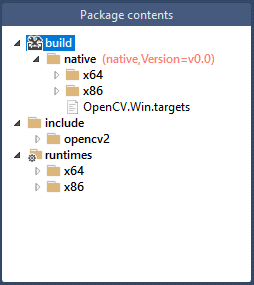

# NuGet package creation
## Building packages
Easiest method to create packages is using the Microsoft provided tool. To create a new NuGet package: 

1. Download the [NuGet Package Explorer](https://github.com/NuGetPackageExplorer/NuGetPackageExplorer)
2. Open the NuGet Package Explorer, select the create a new package
3. Structure the project as below
4. Add **.lib** files under the *native* folder for both *x64 and x86* binaries
5. Add **.dll** files under the *runtimes* folder for both *x64 and x86* binaries
6. Add **.h** include files under the *include* folder
7. Save package, import into Visual Studio project for testing

Sample layout for a project with **Id: OpenCV.Win**




## Sample OpenCV 4.1.1 with extra contrib modules 
I used [vcpkg](https://github.com/microsoft/vcpkg) for building OpenCV binaries (x86, x64)-Universal Windows Platform (UWP) and (x86, x64)-Windows: 

```
# Initial requirements
.\vcpkg.exe install protobuf[core]:x86-windows
.\vcpkg.exe install protobuf[core]:x86-uwp

# UWP OpenCV build (x86, x64)
.\vcpkg.exe install opencv4[core,contrib]:x86-uwp
.\vcpkg.exe install opencv4[core,contrib]:x64-uwp

# Windows OpenCV build (x86, x64)
.\vcpkg.exe install opencv4[core,contrib]:x86-windows
.\vcpkg.exe install opencv4[core,contrib]:x64-windows
```

Copy output files (.lib, .dll, includes) from ```vcpkg\packages\(opencv4_x64-uwp, opencv4_x86-uwp)``` or ```vcpkg\packages\(opencv4_x64-windows, opencv4_x86-windows)``` to the relevant folders of the NuGet package tool.
