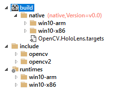

# NuGet package creation
## Building packages
Easiest method to create packages is using the Microsoft provided tool. To create a new NuGet package: 

1. Download the [NuGet Package Explorer](https://github.com/NuGetPackageExplorer/NuGetPackageExplorer)
2. Open the NuGet Package Explorer, select the create a new package
3. Structure the project as below
4. Add **.lib** files under the *native* folder for both *x64 and x86* binaries
5. Add **.dll** files under the *runtimes* folder for both *x64 and x86* binaries
6. Add **.h** include files under the *include* folder
7. Save package, import into Visual Studio project for testing

Sample layout for a project with **Id: OpenCV.Win** (targets file must have same name as NuGet pack)




## Sample OpenCV 4.1.1 ArUco build for HoloLens with extra contrib modules 
**Use the provided OpenCV.HoloLens.targets file as a template**, where you will need to update the .targets file for any additional .lib and .dll additions.

### Option 1: use [vcpkg](https://github.com/microsoft/vcpkg) for building OpenCV HoloLens x86 Universal Windows Platform binaries:

```
# Initial requirements
.\vcpkg.exe install protobuf[core]:x86-windows
.\vcpkg.exe install protobuf[core]:x86-uwp

# UWP OpenCV build (x86)
.\vcpkg.exe install opencv4[core,contrib]:x86-uwp
```

Copy output files (.lib, .dll, includes) from ```vcpkg\packages\(opencv4_x64-uwp, opencv4_x86-uwp)``` or ```vcpkg\packages\(opencv4_x64-windows, opencv4_x86-windows)``` to the relevant folders of the NuGet package tool.

### Option 2: Build OpenCV from source for HoloLens 1 (x86) or HoloLens 2 (ARM) UWP
Build OpenCV from source using CMake. Configure project as below:


Specify the extra modules path if you'd like to install additional modules, *Configure* then *Generate*:


Specify the modules which you are likely to use. For my purposes, these included: 
```
aruco
calib3d
core
features2d
flann
imgcodecs
imgproc
```
Disable all other modules in CMake and confirm the modules which are to be built.


Open Visual Studio solution after running *Generate* in CMake. Build the project (or whatever module you would like to use). Copy output .dll files, .lib files and include files to the NuGet package and update the .targets file.

Copy output files (.lib, .dll, includes) from ```OpenCV\Build\(bin\lib\include)``` to the relevant folders of the NuGet package tool.
